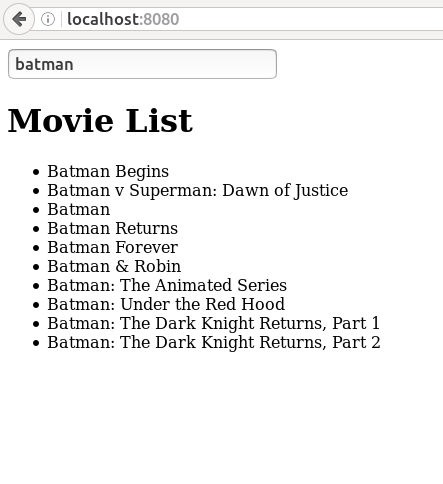

#Redux Movie Search

## Introduction

Jordan's friend, Georgia Luthers is opening a movie theater. She wants to hire you because the menu board was so well done, and could use your expert skills in building a **React-Redux** movie search app. 

She already built some of it, but it doesn't quite seem to work. There's lots of bugs in addition to it not utilizing redux correctly!

## Setup

* Clone this repository. 
* Make sure to `npm install`!
* If you see an error in your terminal as well as a blank screen at http://localhost:8080 congrats! That's totally according to plan. 

## Outline

* The completed app should send the correct GET request to the server.
* The completed app dynamically searched the OMDB Api for whatever string is in the input box.
* The results are displayed below the search component. 

## Steps

1. Okay so your first goal may be to see what Georgia left so far for you. What do you think is missing and stopping the basic view from rendering? (Hint: your basic javascript console may hold the secret)

2. Spoiler alert! By this point we should see what Georgia had so far. She swears she knew nothing about that particular file. Next up on the agenda, Georgia only got her search app to render an input box and the words **Movie List**. That doesn't look anything like the very detailed wireframe above. Let's put some dummy data in the component's **initialState**. You can do it, Georgia's reputation is on the line! (Hint: look at what `MovieList.jsx` expects as props, it may hint you towards how the dummy sata should be laid out.)

3. Wait a minute, nothing showed up. Well that's because Georgia forgot to map some props in `MovieListApp.jsx`. I wonder what would go there. (Maybe some of Jason's countdown code might hold the answer).

4. Now you have some text from the store on the page, what now? Well, if you remember we needed the app to search the api on every letter in the search box. The onChange handler is already defined and attached to the appropriate component in `MovieList.jsx`. While you're at it, both React components have some functions that need filling in. Try to get the app to console.log() the search value from inside the `MovieList.jsx`onSearch function; the component should also **dispatch** a search (the input value or something by default on load) onSearch as well as when mounted too. Don't forget to map them. 

5. Cool! You got some text on the screen and learned how Georgia's code expected data from you. Let's take a moment to zoom out again to the big picture. Your app needs to hit the [OMDB Api](https://www.omdbapi.com/) to retrieve a list of movies based on a partial string. Georgia suggests the `?s=''` query since it returns an array of objects. Play with the API in Postman or with curl to understand how the data comes back. 

6. Time to zoom back in. Where to? Well let's continue where we left off in class! Check out `actions/index.js`. Take your time, I'm just a block of text on your screen; I can wait. What can you fill in to get the desired outcome of the app? 

## Tips

* Make good use of the redux dev tools.
* Keep an eye on your browser console!

## Grading

You'll be graded on the completed app and code quality. Make Georgia a happy customer too!

**Make sure to submit your assignment as a link to a git repository.**
